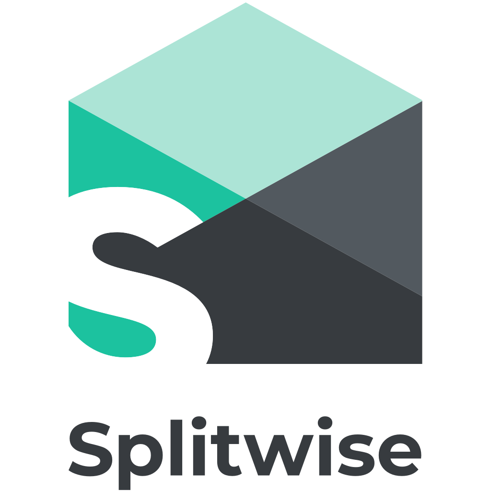

# Enro

Enro is a powerful navigation library for Kotlin Multiplatform — Android, iOS,
Desktop and Web — built around a simple idea: **screens within an application
should behave like functions**.

A `NavigationKey` is the signature of a screen. It declares the screen's inputs,
and optionally a typed result. Calling code never needs to know how the screen
is implemented; it just invokes the contract.

```kotlin
@Serializable
data class ShowProfile(val userId: String) : NavigationKey

@Serializable
data class SelectDate(
    val minDate: LocalDate? = null,
    val maxDate: LocalDate? = null,
) : NavigationKey.WithResult<LocalDate>
```

If you read those as function signatures:

```kotlin
fun showProfile(userId: String): Unit
fun selectDate(minDate: LocalDate? = null, maxDate: LocalDate? = null): LocalDate
```

Enro is Compose-first and Kotlin Multiplatform. On Android, a compatibility
layer (`enro-compat`) keeps existing Fragments and Activities working alongside
Compose destinations, so you can adopt Enro incrementally.

## Getting Started

- [Installation](docs/getting-started/installation.md) — add Enro to your project and install it on each platform.
- [Basic Concepts](docs/getting-started/basic-concepts.md) — the small vocabulary you need to read everything else.
- [Your First Screen](docs/getting-started/your-first-screen.md) — a complete worked example from key to navigation to result.

## Core Concepts

- [Navigation Keys](docs/core-concepts/navigation-keys.md)
- [Navigation Destinations](docs/core-concepts/navigation-destinations.md)
- [Navigation Containers](docs/core-concepts/navigation-containers.md)
- [Navigation Handles](docs/core-concepts/navigation-handles.md)

## Advanced Topics

- [Results](docs/advanced/results.md)
    - [Embedded Result Flows](docs/advanced/results/embedded-result-flows.md)
    - [Managed Result Flows](docs/advanced/results/managed-result-flows.md)
- [View Models](docs/advanced/view-models.md)
- [Animations](docs/advanced/animations.md)
- [Testing](docs/advanced/testing.md)
- [Plugins](docs/advanced/plugins.md)

## Platform-Specific Guides

- [Android](docs/platform/android.md)
- [iOS](docs/platform/ios.md)
- [Desktop](docs/platform/desktop.md)
- [Web](docs/platform/web.md)

## Migrating from Enro 2

Enro 3 is a substantial rewrite. See the [migration guide](docs/migrating-from-v2.md)
for the API delta and a step-by-step conversion.

## Recipes

The [recipes module](https://github.com/isaac-udy/Enro/tree/main/recipes/src/commonMain/kotlin/dev/enro/recipes)
in the source repo is a set of small, runnable examples — one per concept. The
documentation below links into them for every working snippet.

## Applications using Enro

<p>
    <a href="https://www.splitwise.com/">
        
    </a>
    &nbsp;&nbsp;
    <a href="https://play.google.com/store/apps/details?id=com.beyondbudget">
        
    </a>
</p>

---

*"The novices' eyes followed the wriggling path up from the well as it swept a great meandering arc around the hillside. Its stones were green with moss and beset with weeds. Where the path disappeared through the gate they noticed that it joined a second track of bare earth, where the grass appeared to have been trampled so often that it ceased to grow. The dusty track ran straight from the gate to the well, marred only by a fresh set of sandal-prints that went down, and then up, and ended at the feet of the young monk who had fetched their water." — [The Garden Path](http://thecodelesscode.com/case/156)*
